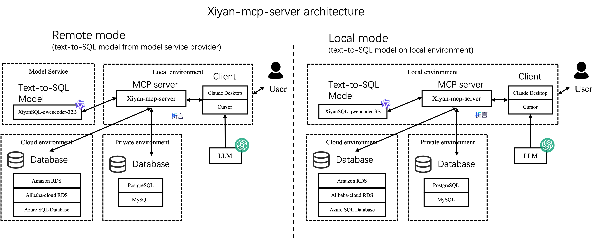
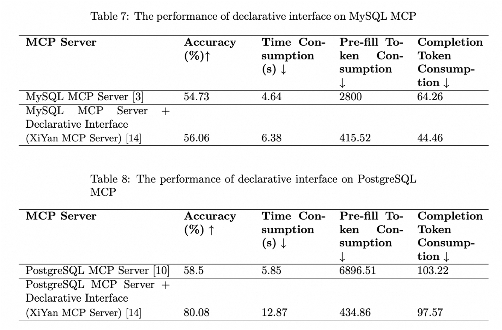

# XiYan MCP サーバー

<p align="center">
  <a href="https://github.com/XGenerationLab/XiYan-SQL"></a>
</p>
<p align="center">
  <b>自然言語でデータベースにクエリを実行できるモデルコンテキストプロトコル（MCP）サーバー</b><br/>
  <sub>オープンベンチマークでのテキストからSQLへのSOTAを実現する<a href="https://github.com/XGenerationLab/XiYan-SQL">XiYan-SQL</a>によって提供されています</sub>
</p>

<p align="center">
💻 <a href="https://github.com/XGenerationLab/xiyan_mcp_server">XiYan-mcp-server</a> | 
🌐 <a href="https://github.com/XGenerationLab/XiYan-SQL">XiYan-SQL</a> |
📖 <a href="https://arxiv.org/abs/2411.08599">Arxiv</a> | 
📄 <a href="https://paperswithcode.com/paper/xiyan-sql-a-multi-generator-ensemble">PapersWithCode</a>
💻 <a href="https://huggingface.co/collections/XGenerationLab/xiyansql-models-67c9844307b49f87436808fc">HuggingFace</a> |
🤖 <a href="https://modelscope.cn/collections/XiYanSQL-Models-4483337b614241">ModelScope</a> |
🌕 <a href="https://bailian.console.aliyun.com/xiyan">析言GBI</a> 
<br />

<a href="https://arxiv.org/abs/2411.08599"></a>
<a href="https://opensource.org/licenses/Apache-2.0">
  
</a>
<a href="https://pepy.tech/projects/xiyan-mcp-server"></a>
  <a href="https://smithery.ai/server/@XGenerationLab/xiyan_mcp_server"></a>
<a href="https://github.com/XGenerationLab/xiyan_mcp_server" target="_blank">
    
</a>
<br />
<a href="https://github.com/XGenerationLab/xiyan_mcp_server">英語</a> | <a href="https://github.com/XGenerationLab/xiyan_mcp_server/blob/main/README_zh.md">中国語</a><br />
<a href="https://github.com/XGenerationLab/xiyan_mcp_server/blob/main/imgs/dinggroup_out.png">Ding Group</a> | 
<a href="https://weibo.com/u/2540915670" target="_blank">Weiboでフォロー</a>
</p>

## 目次

- [特徴](#特徴)
- [プレビュー](#プレビュー)
  - [アーキテクチャ](#アーキテクチャ)
  - [ベストプラクティス](#ベストプラクティス)
  - [ツールプレビュー](#ツールプレビュー)
- [インストール](#インストール)
  - [pipからのインストール](#pipからのインストール)
  - [Smithery.aiからのインストール](#smitheryaiからのインストール)
- [設定](#設定)
  - [LLM設定](#llm設定)
    - [一般的なLLM](#一般的なllm)
    - [テキストからSQLへのSOTAモデル](#テキストからsqlへのsotaモデル)
    - [ローカルモデル](#ローカルモデル)
  - [データベース設定](#データベース設定)
    - [MySQL](#mysql)
    - [PostgreSQL](#postgresql)
- [起動](#起動)
  - [Claude Desktop](#claude-desktop)
  - [Cline](#cline)
  - [Goose](#goose)
  - [Cursor](#cursor)
- [動作しない場合](#動作しない場合)
- [引用](#引用)

## 特徴
- 🌐 [XiYanSQL](https://github.com/XGenerationLab/XiYan-SQL)を通じて自然言語でデータを取得
- 🤖 一般的なLLM（GPT, qwenmax）、テキストからSQLへのSOTAモデルをサポート
- 💻 純粋なローカルモードをサポート（高セキュリティ！）
- 📝 MySQLとPostgreSQLをサポート
- 🖱️ 利用可能なテーブルをリソースとしてリスト
- 🔧 テーブル内容を読み取る

## プレビュー
### アーキテクチャ
このサーバーをプロジェクトに統合する方法は2つあります。以下の図に示されています：
左側はリモートモードで、デフォルトモードです。サービスプロバイダーからxiyanSQL-qwencoder-32BモデルにアクセスするためにAPIキーが必要です（[設定](#設定)を参照）。
もう一つのモードはローカルモードで、より安全です。APIキーは必要ありません。



### ベストプラクティスとレポート

["MCP + Modelscope API-Inferenceを使用して、コードを一行も書かずにローカルデータアシスタントを構築する"](https://mp.weixin.qq.com/s/tzDelu0W4w6t9C0_yYRbHA)

["Modelscope上のXiyan MCP"](https://modelscope.cn/headlines/article/1142)

### MCPBenchでの評価
以下の図は、MCPBenchベンチマークで測定されたXiYan MCPサーバーのパフォーマンスを示しています。XiYan MCPサーバーは、MySQL MCPサーバーおよびPostgreSQL MCPサーバーと比較して優れたパフォーマンスを示し、2〜22パーセントポイントのリードを達成しています。詳細な実験結果は[MCPBench](https://github.com/modelscope/MCPBench)およびレポート["MCPサーバーの評価レポート"](https://arxiv.org/abs/2504.11094)で確認できます。



### ツールプレビュー
 - ツール``get_data``は、データベースからデータを取得するための自然言語インターフェースを提供します。このサーバーは、入力された自然言語をSQLに変換し、データベースを呼び出してクエリ結果を返します。

 - ``{dialect}://{table_name}``リソースは、特定のtable_nameを指定した場合に、データベースからモデル参照用のサンプルデータの一部を取得することを許可します。
- ``{dialect}://``リソースは、現在のデータベースの名前をリストします。

## インストール
### pipからのインストール

Python 3.11以上が必要です。
pipを通じてサーバーをインストールできます。最新バージョンがインストールされます：

```bash
pip install xiyan-mcp-server
```

その後、以下のコマンドでサーバーを直接実行できます：
```bash
python -m xiyan_mcp_server
```
ただし、以下の設定を完了するまで機能は提供されません。
ymlファイルを取得します。その後、以下の方法でサーバーを実行できます：
```yaml
env YML=path/to/yml python -m xiyan_mcp_server
```

### Smithery.aiからのインストール
[@XGenerationLab/xiyan_mcp_server](https://smithery.ai/server/@XGenerationLab/xiyan_mcp_server)を参照

完全にはテストされていません。

## 設定

サーバーを設定するには、YAML設定ファイルが必要です。
デフォルトの設定ファイルconfig_demo.ymlが提供されています。内容は以下の通りです：

```yaml
model:
  name: "XGenerationLab/XiYanSQL-QwenCoder-32B-2412"
  key: ""
  url: "https://api-inference.modelscope.cn/v1/"

database:
  host: "localhost"
  port: 3306
  user: "root"
  password: ""
  database: ""
```

### LLM設定
``Name``は使用するモデルの名前、``key``はモデルのAPIキー、``url``はモデルのAPIアドレスです。以下のモデルをサポートしています。

| バージョン | 一般的なLLM（GPT, qwenmax） | ModelscopeによるSOTAモデル | DashscopeによるSOTAモデル | ローカルLLM |
|----------|-------------------------------|-----------------------------|----------------------------|----------------|
| 説明     | 基本的で使いやすい           | 最高のパフォーマンス、安定、推奨 | 最高のパフォーマンス、試用用 | 遅い、高セキュリティ |
| 名前     | 公式モデル名（例：gpt-3.5-turbo, qwen-max） | XGenerationLab/XiYanSQL-QwenCoder-32B-2412 | xiyansql-qwencoder-32b | xiyansql-qwencoder-3b |
| キー     | サービスプロバイダーのAPIキー（例：OpenAI, Alibaba Cloud） | ModelscopeのAPIキー | メールで取得するAPIキー | "" |
| URL      | サービスプロバイダーのエンドポイント（例："https://api.openai.com/v1"） | https://api-inference.modelscope.cn/v1/ | https://xiyan-stream.biz.aliyun.com/service/api/xiyan-sql | http://localhost:5090 |

#### 一般的なLLM
一般的なLLMを使用する場合、例：gpt3.5、以下のように設定できます：
```yaml
model:
  name: "gpt-3.5-turbo"
  key: "YOUR KEY"
  url: "https://api.openai.com/v1"
database:
```

AlibabaのQwenを使用する場合、例：Qwen-max、以下の設定を使用できます：
```yaml
model:
  name: "qwen-max"
  key: "YOUR KEY"
  url: "https://dashscope.aliyuncs.com/compatible-mode/v1"
database:
```
#### テキストからSQLへのSOTAモデル
テキストからSQLへのSOTAモデルであるXiYanSQL-qwencoder-32B（https://github.com/XGenerationLab/XiYanSQL-QwenCoder）を推奨します。以下の2つの方法でモデルを使用できます。
(1) [Modelscope](https://www.modelscope.cn/models/XGenerationLab/XiYanSQL-QwenCoder-32B-2412)、(2) Alibaba Cloud DashScope。

##### (1) Modelscopeバージョン
ModelscopeからAPI推論の``key``を申請する必要があります。https://www.modelscope.cn/docs/model-service/API-Inference/intro
その後、以下の設定を使用できます：
```yaml
model:
  name: "XGenerationLab/XiYanSQL-QwenCoder-32B-2412"
  key: ""
  url: "https://api-inference.modelscope.cn/v1/"
```

詳細については、[モデルの説明](https://www.modelscope.cn/models/XGenerationLab/XiYanSQL-QwenCoder-32B-2412)を参照してください。

##### (2) Dashscopeバージョン

Alibaba Cloud DashScopeにモデルをデプロイしましたので、以下の環境変数を設定する必要があります：
``key``を取得するためにメールを送信してください。（godot.lzl@alibaba-inc.com）
メールには以下の情報を添付してください：
```yaml
name: "YOUR NAME",
email: "YOUR EMAIL",
organization: "your college or Company or Organization"
```
メールに基づいて``key``を送信します。ymlファイルに``key``を記入できます。
``key``は1ヶ月または200クエリまたはその他の法的制限で期限切れになります。

```yaml
model:
  name: "xiyansql-qwencoder-32b"
  key: "KEY"
  url: "https://xiyan-stream.biz.aliyun.com/service/api/xiyan-sql"
database:
```

注意：このモデルサービスは試用のみです。生産で使用する場合は、私たちに連絡してください。

または、モデル[XiYanSQL-qwencoder-32B](https://github.com/XGenerationLab/XiYanSQL-QwenCoder)を自分のサーバーにデプロイすることもできます。

#### ローカルモデル
注意：ローカルモデルは遅いです（私のMacBookではクエリごとに約12秒かかります）。
安定して高速なサービスが必要な場合は、Modelscopeバージョンを使用することをお勧めします。

ローカルモードでxiyan_mcp_serverを実行するには、以下が必要です：
1）少なくとも16GBのRAMを持つPC/Mac
2）6GBのディスクスペース

ステップ1：追加のPythonパッケージをインストール
```bash
pip install flask modelscope torch==2.2.2 accelerate>=0.26.0 numpy=2.2.3
```

ステップ2：（オプション）モデルを手動でダウンロード
[xiyansql-qwencoder-3b](https://www.modelscope.cn/models/XGenerationLab/XiYanSQL-QwenCoder-3B-2502/)をお勧めします。
以下のコマンドでモデルを手動でダウンロードできます：
```bash
modelscope download --model XGenerationLab/XiYanSQL-QwenCoder-3B-2502
```
6GBのディスクスペースが必要です。

ステップ3：スクリプトをダウンロードしてサーバーを実行します。ファイルsrc/xiyan_mcp_server/local_xiyan_server.py

```bash
python local_xiyan_server.py
```
サーバーはhttp://localhost:5090/で実行されます。

ステップ4：設定を準備してxiyan_mcp_serverを実行
config.ymlは以下のようになります：
```yaml
model:
  name: "xiyansql-qwencoder-3b"
  key: "KEY"
  url: "http://127.0.0.1:5090"
```

これでローカルモードの準備が整いました。

### データベース設定
``host``、``port``、``user``、``password``、``database``はデータベースの接続情報です。

ローカルまたは任意のリモートデータベースを使用できます。現在、MySQLとPostgreSQLをサポートしています（他の方言も近日中にサポート予定）。

#### MySQL

```yaml
database:
  host: "localhost"
  port: 3306
  user: "root"
  password: ""
  database: ""
```
#### PostgreSQL
ステップ1：Pythonパッケージをインストール
```bash
pip install psycopg2
```
ステップ2：config.ymlを以下のように準備します：
```yaml
database:
  dialect: "postgresql"
  host: "localhost"
  port: 5432
  user: ""
  password: ""
  database: ""
```

注意：PostgreSQLの場合、``dialect``は``postgresql``である必要があります。

## 起動
### Claude Desktop
Claude Desktopの設定ファイルに以下を追加します。<a href="https://github.com/XGenerationLab/xiyan_mcp_server/blob/main/imgs/claude_desktop.jpg">Claude Desktop設定例</a>を参照
```json
{
    "mcpServers": {
        "xiyan-mcp-server": {
            "command": "python",
            "args": [
                "-m",
                "xiyan_mcp_server"
            ],
            "env": {
                "YML": "PATH/TO/YML"
            }
        }
    }
}
```
### Cline
[Claude Desktop](#claude-desktop)の設定を準備

### Goose
設定に以下のコマンドを追加します。<a href="https://github.com/XGenerationLab/xiyan_mcp_server/blob/main/imgs/goose.jpg">Goose設定例</a>を参照

```yaml
env YML=path/to/yml python -m xiyan_mcp_server
```
### Cursor
[Goose](#goose)と同じコマンドを使用

### Witsy
コマンドに以下を追加：
```yaml
python -m xiyan_mcp_server
```
環境変数を追加：キーはYML、値はymlファイルのパス。
<a href="https://github.com/XGenerationLab/xiyan_mcp_server/blob/main/imgs/witsy.jpg">Witsy設定例</a>を参照

## 動作しない場合
お問い合わせ：
<a href="https://github.com/XGenerationLab/xiyan_mcp_server/blob/main/imgs/dinggroup_out.png">Ding Group</a> | 
<a href="https://weibo.com/u/2540915670" target="_blank">Weiboでフォロー</a>

## 引用
私たちの仕事が役立つと思われる場合は、自由に引用してください。
```bib
@article{xiyansql,
      title={A Preview of XiYan-SQL: A Multi-Generator Ensemble Framework for Text-to-SQL}, 
      author={Yingqi Gao and Yifu Liu and Xiaoxia Li and Xiaorong Shi and Yin Zhu and Yiming Wang and Shiqi Li and Wei Li and Yuntao Hong and Zhiling Luo and Jinyang Gao and Liyu Mou and Yu Li},
      year={2024},
      journal={arXiv preprint arXiv:2411.08599},
      url={https://arxiv.org/abs/2411.08599},
      primaryClass={cs.AI}
}
```
